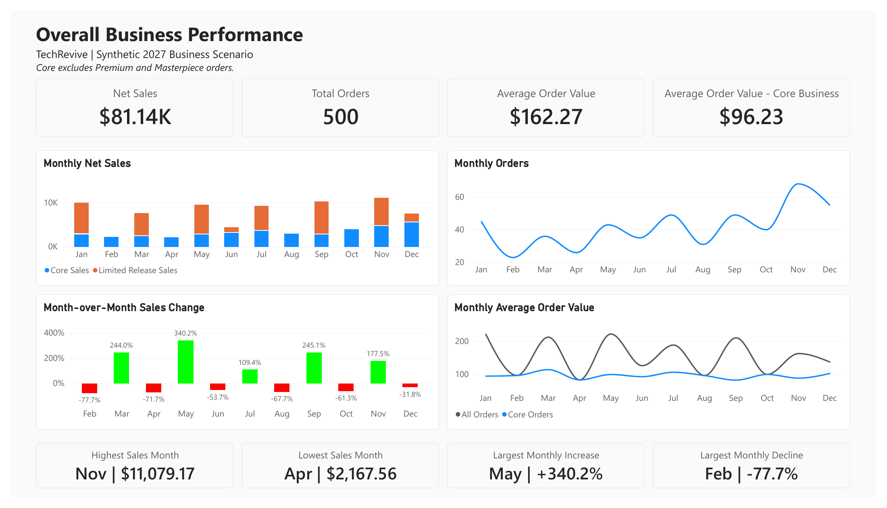

# TechRevive 2027 | Sales & Website Analytics

**Status: In progress**  
**Dataset: Simulated 2027 activity using TechRevive catalog references**

An ecommerce analytics portfolio project exploring sales, product performance, and website conversion for a controller repair, upgrade, and refurbishment business. The project is being developed in Power BI, with space to add SQL queries and documented findings as the analysis progresses.

## Power BI report: overall business performance

[**View or download the one-page report (PDF)**](power-bi/overall-business-performance.pdf)

[](power-bi/overall-business-performance.pdf)

Built in Power BI Desktop and exported as a static PDF. The report covers annual net sales, order count, average order value, monthly sales and orders, month-over-month sales change, and comparisons between all orders and core business.

**Core business** excludes whole orders whose `primary_category` is `Premium` or `Masterpiece`. The stacked sales chart separates core sales from those limited-release orders. Net sales uses order subtotals in USD and excludes taxes, shipping, fees, and costs.

All results describe the fictional 2027 practice scenario, not actual TechRevive performance or a forecast.

## Business questions

- How do sales and order volume vary across months?
- How do Online Store and eBay sales compare?
- Which products and services contribute the most sales?
- How does website conversion vary over time, by device, and by traffic source?

These are project questions, not conclusions about actual TechRevive performance.

## Data and transparency

All orders, customer identifiers, and website activity in this dataset are fictional. The dataset was generated with AI assistance for practice. Its documentation records real TechRevive catalog titles, prices, SKUs, and product identifiers checked on September 25, 2026. Premium and Masterpiece releases are hypothetical.

The 2027 dates describe a practice scenario. This project is not a forecast or a report of actual business results. Some patterns were deliberately built into the simulation; finding those patterns does not establish real customer behavior.

The supplied version 2 dataset contains:

| Source file | What one row represents |
| --- | --- |
| `orders_2027.csv` | One order |
| `order_items_2027.csv` | One item within an order |
| `sales_2027_flat.csv` | One item with its order and catalog details |
| `products.csv` | One catalog reference or hypothetical release |
| `releases_2027.csv` | One hypothetical limited release |
| `website_sessions_2027.csv` | One simulated website visit |
| `website_traffic_daily_2027.csv` | One day of website activity |

See the [dataset documentation](data/source/README.md), [data dictionary](data/source/data_dictionary.csv), and [report definitions](data/source/REPORT_GUIDE.md) for source assumptions and column meanings.

## SQL analysis: sales overview

The first set of completed PostgreSQL queries is organized below. These files preserve the original query logic, including the preliminary order checks; only comments and whitespace have been organized for readability. Each query has a comment stating the question it answers.

| Analysis | Questions answered |
| --- | --- |
| [01 - Monthly revenue](sql/01_monthly_revenue.sql) | How much revenue did TechRevive generate by month? |
| [02 - Monthly order volume](sql/02_monthly_order_volume.sql) | How many orders did TechRevive receive each month? |
| [03 - Average order value](sql/03_average_order_value.sql) | What is the average order value, both overall and excluding Premium and Masterpiece orders? |
| [04 - Month-over-month revenue growth](sql/04_month_over_month_revenue_growth.sql) | Is revenue growing or declining from month to month, both overall and excluding Premium and Masterpiece orders? |
| [05 - Unusual sales months](sql/05_unusual_sales_months.sql) | Which months have unusually high or low revenue, both overall and excluding Premium and Masterpiece orders? |

### Running and interpreting the queries

- Run these files in PostgreSQL after importing [orders_2027.csv](data/source/orders_2027.csv) into `techrevive_2027.orders_2027`. Use a date type for `order_date`, a numeric type for `subtotal_usd`, and text for `order_id` and `primary_category`. These analysis files do not create or import tables.
- Run individual statements to view each result separately. Files 02, 03, and 04 begin with the original order-level inspection query.
- The original date strings use month/day/year format, so the PostgreSQL session must use MDY date interpretation. The average order value queries use the entire table without a date filter and assume it contains only the supplied 2027 orders.
- Revenue here means the sum of `subtotal_usd`; average order value is the mean of those order subtotals. Currency formatting follows the PostgreSQL session locale. Taxes, shipping, fees, and costs are not included in these measures.
- The comparison queries exclude whole orders whose `primary_category` is `Premium` or `Masterpiece`; they do not remove individual line items from mixed orders.
- Monthly growth is displayed as an integer percentage. The first month has no previous-month comparison. The original formula assumes the previous month's revenue is nonzero, and months without orders do not appear.
- Unusually high or low months fall more than one population standard deviation above or below the mean of the monthly revenue values returned by the query. This is a descriptive rule for the simulated dataset, not proof of a real-world anomaly.

This section documents the questions and query methods. Numerical findings and business recommendations are not added here.

## Current progress

- Version 2 practice data and its documentation are included.
- The first Power BI overview is complete and available as a [one-page PDF](power-bi/overall-business-performance.pdf), with a preview above.
- The first set of completed SQL queries is included in the [SQL analysis section](#sql-analysis-sales-overview). The editable Power BI (.pbix) file is not included.
- Further analysis of products, sales channels, and website conversion remains in progress.

## Repository layout

```text
data/source/       Supplied version 2 data, documentation, and example reports
sql/               SQL queries as they are completed
power-bi/          Exported Power BI reports (PDF)
images/            Report preview images
```

The CSV reports in `data/source/reports/` were supplied with the generated dataset as reference outputs. They are not presented as independently completed portfolio analysis. The included source `VALIDATION.md` records the dataset preparation checks, not validation of the developing Power BI report.

## Measurement rules

- Count distinct order IDs when using the flat sales file: an order can have several item rows.
- Use item amounts for item-level sales. Do not sum repeated order totals across item rows.
- Calculate website conversion as converted sessions divided by total sessions. Exclude eBay orders from website conversion.
- For a month or year, divide the summed converted-session count by the summed session count rather than averaging daily conversion rates.
- Inspect blank values before removing records. Some missing SKU, device, and referrer values are intentional.
- Keep traffic and sales at appropriate levels of detail so joins do not duplicate visits or sales.

Costs, marketplace fees, taxes, and shipping are not modeled. The dataset supports sales analysis; it does not support a complete profit calculation.

## Working with the files

Download or clone this repository and read `data/source/README.md` first. The flat sales CSV provides an accessible starting point for sales analysis. Website traffic is stored separately for conversion analysis. The detailed orders, items, and products files support relational modeling.

Additional queries, report pages, and instructions for reproducing the analysis will be added as the project develops.
